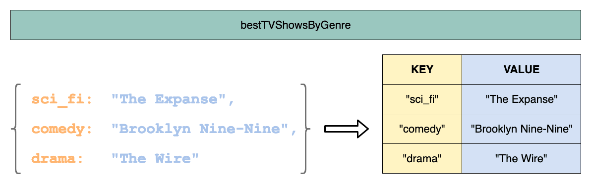

# Notes on Objects
# Objects 

# Coercion and Truthy/Falsey

## Double Equals, Triple Equals, and Type Coercion


# Objects in JS
An introduction to the use of Objects to store data and behavior, the concept of key-value pairs, passing objects into functions, but also functions inside of objects!

## Topics
* Primitive data types
* Objects Fundamentals
  * Their advantages for data lookup vs arrays
  * How they are passed to functions
* Functions as object methods
* Using `this` when inside an object's function

### Six Primitive Types in JavaScript
> In JS, all **all values which are not Objects** are collectively referred to as **primitivess**

#### Six types of primitives:
* undefined
* null
* boolean
* string
* number
* symbol

### Objects Are Not Primitives
Anything not in the list above (for example, a `Date`) is an Object. Objects are not primitive data types. 
Arrays and functions are a sub-category of objects. Objects have properties. 
The six primitive types plus object, make up the seven fundamental types of JavaScript. 

### Conclusion
Objects are used to define more complex data types(such as arrays, dates, key-value pairs, etc.) They are not data types. 


<br>

>### **Objects at a Glance** 
>* Contain key-value pairs; each key maps to a value
>* Contain keys which are always strings (or symbols, but it's less common and not important right now)
>* Have unique keys; the same key cannot appear twice in an object
>* Have their keys point to values which can be of any type

<br>
<br>

### Object Literals

Recap: some values can be represented by literals: we have string literals like `"lighthouse"`, number literals like `5` and `7.5,` etc. Arrays also have a literal syntax using square brackets: `[1, 2, 3]` is a 3-element array.

Likewise, objects have a literal syntax using braces `{}`. Here is an empty *object literal* assigned to a variable: 

<br>

> ### What are Literals?
> * Javascript Literals are `constant` values that can be assigned to the variables that are called literals or constants. 
> * JavaScript Literals are syntactic representations for different types of data like `numeric, string, Boolean, array`, etc data. 
>* The values we write in a conventional form whose value is obvious. 
>* In contrast to variables, **literals (123, 4.3, "hi") do not change in value**. THese are also called explicit constants or manifest constants. 

<br>

> **What is mapping of data in Java**
> Mapping enables you to relate objects in your application to data in a database. This chapter discusses how you can use Java code to implement mappings in TopLink-based applications.

```javascript
const emptyObject = {};
```

And an object literal with a single key-value pair: 

```javascript
const tinyObject = { "size": "Tiny" };
```
This object has a single key (th string "size") associated with a value (the string `"Tiny"`). 
NOte that while our key `size` is enclosed in double quotes like a stirng, it can still be considered a string without the quotes around it. So we can save a few characters and make it read nicer by writing this instead:

```javascript
const tinyObject = { size: "Tiny" }; 
```
### Objects are Like 2-Column Tables


<br>
<br>

* Objects arllow us to easily access the values (in the second column) via a quick reference to their respective keys (in first column).

## Object Values
An object's values can be of any type. 

```javascript
const myObject = {
  a: 6,     // Number
  b: "abc", // String
  c: true,  // Boolean
  d: null,  // Null
};
```


## Accessing Object Values

To retrieve a value within an object, use square-bracket notation.
* When accesssing an object property using the square brackets (`[]`) syntax, the key **must** be quoted (as a string). otherwise, it would be considered a variable name instead of a string litera. 

>If that variable name instead points to a string, then that can be an interesting way of accessing a key:

```javascript
const person = { firstName: "Khurram" };
const propertyName = "firstName";
const firstName = person[propertyName]; // interpreted as person["firstName"], and therefore works fine :)
```

Alternative way to access the same valeu: person.firstName. 

## Accessing a Key That Doesn't Exist
don't use `"undefined"` as an object value manully. 

## Objects as Values

```javascript
const person = {
  name: "Paul",
  address: {
    street: "310 W 95th",
    city: "New York",
    zipCode: 10027
  }
};
```
Shows that the value associated with the `address key` can be another object. 

Objects can **nest** inside an object
```javascript
person["address"]["city"]; // => "New York"
```

## Object Keys

1. Keys are always strings
2. Each key is unique (can only occur once in the object)
3. Each key is associated with exactly one value. 

By convention, we omit the quotes around keys in string literals whenever we can. If the key is a valid variable name, then we don't have to include quotes. 

Two ways of specifying the same **value** in an object literal: using a literal string for the value, or using a variable: 

```javascript
const spam = "spam";
person["dislikes"] = { food: spam, "e-mail": "spam" };
```

## Object.keys
Method: **`Object.keys(...)`** that returns an array of keys. 


## Conclusion
1. Most common way to create objects (`const 0 = {})
2. Accessing and setting properties on objects using string keys ( `O["key"]`)
3. Getting a list of all the keys in an object (Object.keys(O). 
)


<br>
<br>
<br>

# Objects and Iteration
However, JavaScript objects, `{key: value}`, themselves are not iterable in the way that arrays are. Instead we need to do things a little differently, using a `for...in` statement.

### Example code

```javascript
var planetMoons = {
  mercury: 0,
  venus: 0,
  earth: 1,
  mars: 2,
  jupiter: 67,
  saturn: 62,
  uranus: 27,
  neptune: 14
};
```

```javascript
for (var planet in planetMoons) {
  var numberOfMoons = planetMoons[planet];
  console.log("Planet: " + planet + ", # of Moons: "+ numberOfMoons);
}
```

### Limitations of `for ... in`

Objects can sometimes have properties that they inherit from their prototype chain as well as method names. An additional filtering step is sometimes necessary: 

```javascript
for (var planet in planetMoons) {
  var numberOfMoons = planetMoons[planet];
  console.log("Planet: " + planet + ", # of Moons: "+ numberOfMoons);
}
```

### How do I loop through or enumerate a JavaScript Object?

#### Example
```javascript
var p = {
    "p1": "value1",
    "p2": "value2",
    "p3": "value3"
};
```
>How to loop through all of p's elements (p1, p2, p3...) and get their keys and values?

#### Answer: 
```javascript
var p = {
    "p1": "value1",
    "p2": "value2",
    "p3": "value3"
};

for (var key in p) {
    if (p.hasOwnProperty(key)) {
        console.log(key + " -> " + p[key]);
    }
}
```
```
p1 -> value1
p2 -> value2
p3 -> value3
```

#### For-of with Object.keys() alternative:

```javascript
var p = {
    0: "value1",
    "b": "value2",
    key: "value3"
};

for (var key of Object.keys(p)) {
    console.log(key + " -> " + p[key])
}
```

### Using the new Object.entries() method:

```javascript
const p = {
    "p1": "value1",
    "p2": "value2",
    "p3": "value3"
};

for (const [key, value] of Object.entries(p)) {
  console.log(`${key}: ${value}`);
}
```

``


## countOnly
Takes in a collection of items and return counts for a specific subset of those items. It won't count everything. In order to decide what to count, it will also be given an idea of which items we care about and it will only count those, ignoring others. 

Only keys which have a truthy value should be counted in the resulting object. 


## Looping Object and Arrays
We use `for...of` or `forEach` to loop over an array. 

```js
const destinations = ['Vancouver', 'Calgary', 'Edmonton', 'Saskatoon', 'Regina']; 

for (const destination of destinations) {
  console.log("Now arriving", destination); 
}
```
remember `for...of` loops are desgined for arrays!
With objects, we use `for...in` to iterate over the keys of the object. 

```js
const instructors = {
  1: {
    id: '1',
    name: 'Ian'
  },
  2: {
    id: '2',
    name: 'Taiwo'
  }
};

for (const key in instructors) {
  // key is variable, so use bracket notation to access the value
  console.log(key, instructors[key])
}
/* 
>
1 { id: '1', name: 'Ian' }
2 { id: '2', name: 'Taiwo' }
```
remember `for...in` loops are designed for objects. 


# Udacity Notes:

# typeof 
an operator that returns the name of the data type that follows it: 

```js
typeof "hello" // returns "string"
typeof true // returns "boolean"
typeof [1, 2, 3] // returns "object" (Arrays are a type of object)
typeof function hello() {} // returns "function"
```


## object-literal notation

```js
let sister = {
  name: "Sarah",
  age: 23,
  parents: ["alice", "andy"],
  siblings: ["Julia"],
  favouriteColor: "purple",
  pets: true
};
```

* The "key" (representing a 
 **property** or **method** name) and its "value" are separated from each other by a **colon**. 
 * The `key: value` pairs are separated from each other by commas
 * The entire object is wrapped inside the curly braces {}. 

```js
 sister["parents"] // returns ["alice", "andy"]
 sister.parents // also returns the same
 ```

> bracket notation: sister["parents"] 
> dot notation: sister.parents


```js

testFunc = () => {

}

betterFunc = () => {
  return null;
}

let x; 

let y = null;

if (!y) {
  console.log("I wa...");
}
```


## for ... in Loop
If a property is modified in one iteration and then visited at a later time, its value in the loop is its value at that later time. A property that is deleted before it has been visited will not be visited later. Properties added to the object over which iteration is occurring may either be visited or omitted from iteration. 

In general, it is best not to add, modify, or remove properties from the object during iteration, other than the property currently being visited. 

### Array iteration and for...in
Array indexes are just enumerable properties with integer names and are otherwise identical to general object properties. 
* It is better to use a for loop with a numerable index, array.prototype.forEach(), or the for...of loop, because they will return the index as a number instead of a stirng, and also avoid non-index properties. 

`object.keys(myObject)`
`object.getOwnPropertyNames(myObject)`

Object.keys will return a list of enumerable own string properties, while Object.getOwnPropertyNames will also contain non-enumerable ones.


### Example
```js
const obj = { a: 1, b: 2, c: 3 };

for (const prop in obj) {
  console.log(`obj.${prop} = ${obj[prop]}`);
}

// Logs:
// "obj.a = 1"
// "obj.b = 2"
// "obj.c = 3"
```

## Iterating own properties
use of `object.hasOwn()` 

```js
const triangle = { a: 1, b: 2, c: 3 };

function ColoredTriangle() {
  this.color = "red";
}

ColoredTriangle.prototype = triangle;

const obj = new ColoredTriangle();

for (const prop in obj) {
  if (Object.hasOwn(obj, prop)) {
    console.log(`obj.${prop} = ${obj[prop]}`);
  }
}

// Logs:
// "obj.color = red"
```

### Object.keys()

It's a static method which returns an array of a given object's own enumerable string-keyed property names. 

```js
const object1 = {
  a: 'somestring',
  b: 42,
  c: false
};

console.log(Object.keys(object1));
// Expected output: Array ["a", "b", "c"]
```

## Object output issue
Objects cannot be used in `console.log` as a string. There is an output issue. Thus, need to use the util library's inspect function. 

### Example: 
```js
const inspect = require('util').inspect;
```
> This helps ouput the object as a value correctly in the console.log.


### First-class citizen
`type, object, entity, or value` in a given programming language is an entity which supports all the operations generally avaialable to other entities. These operations typically include being passed as an argument, returned from a function, and assigned to a variable. 

1. Functions can be stored in variables and passed around. 
2. Functions can do everything that other objects can do(like having properties assigned to them)

## Callback Functions
The most notable usage of **functions as values** in JavaScript is a callback function. 
<br>
<br>

#### A callback function: 
* Is a function papssed (by reference) into another function (let's call that one the **receiver** function)
* The **receiver** function is therefore accepting behavior to perform by calling the **callback** function that it now has access to
* The **receiver** function can decide to call the **callback** function at any time, as many times as it wants. 

```js
const findWaldo = function(names, found) {
  for (let i = 0; i < names.length; i++) {
    let name = names[i];
    if (name === "Waldo") {
      found(); // execute callback
    }
  }
}

const actionWhenFound = function() {
  console.log("Found him!");

}

findWaldo(["Alice", "Bob", "Waldo", "Winston"], actionWhenFound); 
```

Function thus is being treated as an ordinary value and passed around to another function. 

## Using filter on sparse arrays
`filter()` will skip empty slots.
```js
console.log([1, , undefined].filter((x) => 
x === undefined)); // [undefined]

console.log([1, , undefined].filter((x) => 
x !== 2)); // [1, undefined]
```

### Calling filter() on non-array objects
The `filter(0)` method reads the `length` property of `this` and then accesses each integer index.

### Affecting Initial Array (modifying, appending and deleting)
The following examples tests the behaviour of the `filter` method when the array is modified.
```js
